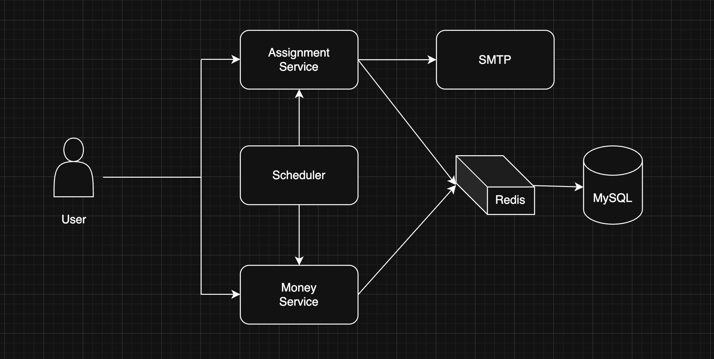
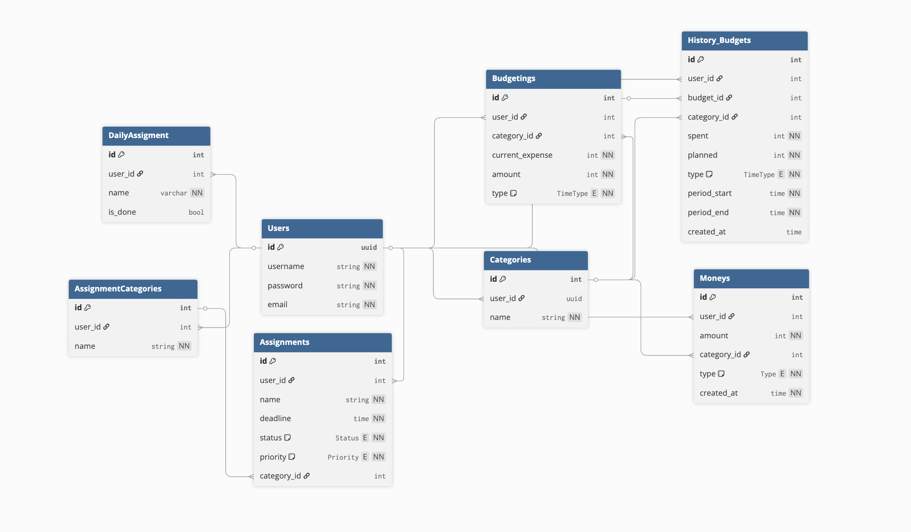

# Do and Daily

Do and Daily is a backend service built with Go (Gin) designed to help users manage their assignments and personal finances effectively.

## Features

### Money Management

- Add transaction to track income and expense
- Create custom money categories for better organization
- Automatically generated a new budget plan for each category(starting at 0)
- Define planned budgets to compare with actual spending

### Assignment Management

- Add assignment with priority level('Low', 'Medium', 'High')
- Create custom categories for assignment
- Manage daily routine's (recurring task that reset every day)

### Scheduler

The system has scheduler that runs automatically. The scheduler will run the following task:

1. Budget Reset

- Automatically reset weekly or mothly budget expense to 0 every week or month (based on user budget)

2. Daily Routine Reset

- "Unmark" daily routine's every day

3. Assignment Notification

- Send email notification whena user's assignment is due today and the status still 'On Going'

## Architecture

### Business Logic Layer

- **Usecase**: Contains business logic implementation
- **Domain**: Handles entity operation and data persistence
- **DTO**: Data Transfer Object for API Documentation
- **Entity**: Core domain models

### Software Architecture



### Component Breakdown

- #### Assignment Service
  Handles all operation related to personal assignments
  1. Create assignment with custom priority and categories
  2. Integrates with SMTP service to send reminders
- #### Money Service
  Manages personal finance tracking for each users
  1. Allows user to track transaction and categorize
  2. Add spending/income entries for each transaction
  3. Define personal money categories and plan budgets
- #### Scheduler
  An background time-based service using a library gocron to automate system routiners:
  1. **Daily Task Reset** - Resets all daily assignments to undone every midnight
  2. **Budget Reset** - Resets user busgets weekly or monthly
  3. **Assignments Notifications** - Sends email if assignments deadline matches the current date
- #### SMTP
  Handles email delivery for assignment deadline alerts. This service connected to Assignment Service and uses GoMail to dispatch structures HTML emails
- #### Redis
  Used as a caching layer to reduce load on MySQL and speed up repeated queries
- #### MySQL
  The main persisteance layer for all user data, including assignments, budgets, transaction, and categories.

### Database Design



## Development Setup

### Prerequisites

- Go 1.21+
- Docker (for running RabbitMQ, PostgreSQL, and Redis)

### Set Up Project

Before running the application, you need to set up the project environment. Follow these steps:

copy the default configuration file:

```bash
cp ./etc/cfg/conf.json.example ./etc/cfg/conf.json
```

you can edit the `conf.json` file to set your environment variables, such as database connection strings, RabbitMQ settings, and other configurations. But i recommend you to follow the default settings, which should work out of the box.

Run the docker-compose to start the necessary services (RabbitMQ, PostgreSQL, and Redis):

```bash
cd env
docker-compose up -d
```

After the services are up, you need to initialize the database schema and seed data. Run the following command:

```bash
cd docs/sql
./init.sh
```

Finally, you can run the application.

### Running the Application

For run the application, you need to install the Swagger tool and generate the API documentation. Run the following commands:

```bash
make swag-install
```

Make sure the installation is correct by running:

```bash
make swaggo
```

After that, you can start the application by running:

```bash
make run
```

This will start the application, and you can access the Swagger documentation at

- `http://localhost:8080/swagger/index.html`

### Register a New User

To begin using the system, register a new user by sending a POST request to:
```
POST http://localhost:8080/auth/v1/register
```
**New Body(JSON)**

```
{
    "name": "your-name",
    "email": "your-email",
    "password": "your-password",
    "confirmPassword": "your-password"
}
```